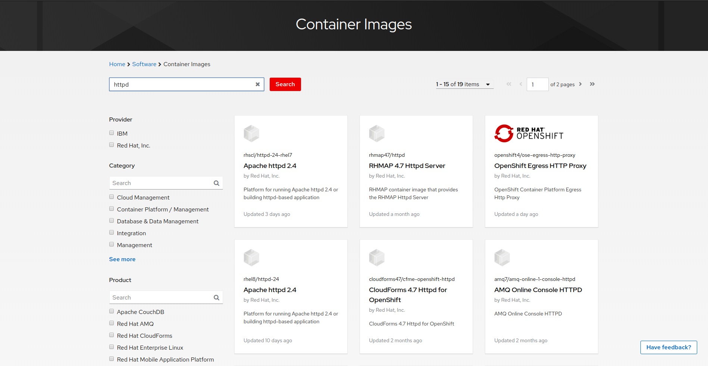
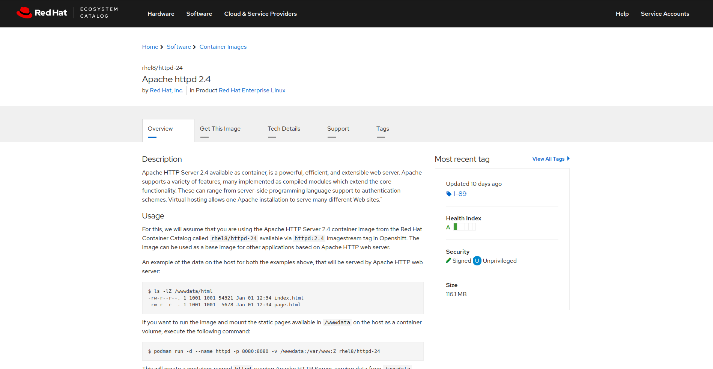
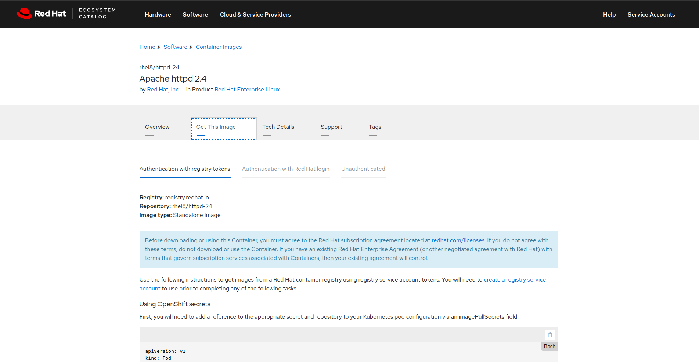

# Breve storia dei containers

L’idea di  isolare un processo è presente fin dal 1979 nel sistema operativo UNIX version 7 grazie all’adozione del chroot system. Nel corso degli anni sono state create molte soluzione per poter creare processi isolati e limitati, ma è circa nel 2008 che il linux kernel incomincia ad offrire funzionalità fondamentali per la creazione di processi isolati e limitati: cgroups, namespaces, seccomp e SELinux. 


## Namespaces (dal 2002)

Grazie ai namespaces possiamo isolare un processo linux. Questa è una lista dei namespaces (presa dal man) presenti nel kernel linux:

Namespace            Isolates
Cgroup         Cgroup root directory
IPC            System V IPC, POSIX message queues
Network        Network devices, stacks, ports, etc.
Mount          Mount points
PID            Process IDs
User           User and group IDs
UTS            Hostname and NIS domain name


Se per esempio creiamo un processo isolato con il namespace ‘Network’, il suddetto processo sarà isolato a livello networking dall’host che l’ha creato.


## CGroups (dal 2007)

Grazie a Control groups (cgroups) possiamo limitare il consumo di risorse da parte di un processo


## Seccomp (dal 2014)

Seccomp ci permette di limitare l'utilizzo delle syscall da parte dei processi.

## SELinux

SELinux protegge i processi fra di loro fra il sistema host


Grazie a queste tecnlogie offerte dal kernel linux è possibile creare processi limitati e isolati chiamati containers.
I conteiners offrono un evironment user-space per poter eseguire applicazioni isolate da altre applicazioni che condividono lo stesso sistema operativo.


Creare questi processi manualmente è possibile ma molto dispendioso; ecco perchè è stato introdotto il concetto di immagine.

Le immagini, nel contesto dei container, sono dei template che racchiudono tutti i file necessari all'applicazione per poter essere messa in running come per esempio le runtime, librerie, file di configurazione etc..

Per fare un parallelo con i linguaggi di programmazione ad oggetti, l'immagine può essere vista come una classe, i conteiner come l'istanza di questa classe.

Da un'immagine possiamo creare N container, esattamente come da una classe possiamo istanziare N oggetti.

Oggi giorno abbiamo miglialia di immagini pronte all'uso archiviate in cataloghi (pubblici o privati) chiamati "Image Repository" o semplicemente "Registry"


# Registry

Un registry è un catalogo di immagini.


I registry più usati sono:

 - **Red Hat Container Catalog**: Registry per i clienti Red Hat. Le immagini sono controllate e verificate da Red Hat.

 
 - **Red Hat Quay**: Registry aperto al pubblico di Red Hat, in cui vi è però un minor controllo su ciò che viene caricato, anche se anche qui viene controllata la presenza o meno di alcuni bug con Clair.
 
 - **Docker Hub**: Registry gestito dalla Docker Inc., aperto al pubblico, senza alcun particolare controllo su ciò che viene caricato.


Sui repository pubblici come Docker Hub e Quay tutti gli utenti possono caricare le proprie immagini e scaricare immagini create da terze parti. 

In ambito enterprise la provenienza delle immagini deve essere accertata e controllata, ecco perchè il repository Red Hat Container Catalog offre immagini controllate e verificate ai propri clienti.

## Come interagire con un registry

Bene, ora vogliamo scaricare delle immagini per i nostri container. Come facciamo?

### Basic: Con un browser!

Per cercare dall'interfaccia web ci basta usare un browser.

Aprendo il nostro browser e aprendo il registry, ad esempio, di [Red Hat Container Catalog](https://catalog.redhat.com/software/containers/explore) possiamo cercare una immagine che ci serve.

Ad esempio, proviamo a cercare un'immagine per httpd:


Otteniamo così una lista delle immagini che corrispondono al criterio di ricerca:



Selezionandone una, ad esempio `rhel8/httpd-24`, possiamo vederne una descrizione sotto la scheda *Overview*



Nella scheda *Get This Image* possiamo vedere diversi modi di usare questa immagine:



Tra cui anche quella da usare con podman:


### Podman

Podman è l'utility permette l'interazione con i registry. Utilizza un formato delle immagini specificato dalla Open Container Initiative (OCI) che definisce uno standard di formato non proprietario e sviluppato dalla community.

Installare podman è veramente semplice, come installare un qualsiasi pacchetto:

```sudo yum install podman```

**N.B.** Nel caso di registry con autenticazione, dobbiamo fornire le credenziali fornire le credenziali:

```bash
# Login ad un registry
$ podman login registry.redhat.io
Username: [redhat_username]
Password: [redhat_password]
```

Possiamo poi cercare i container con i seguenti comandi:

```bash
# Ricerca tra tutti i registry configurati
$ podman search httpd
```

```bash
# Ricerca in un registry specifico
$ podman search registry.redhat.io/httpd


