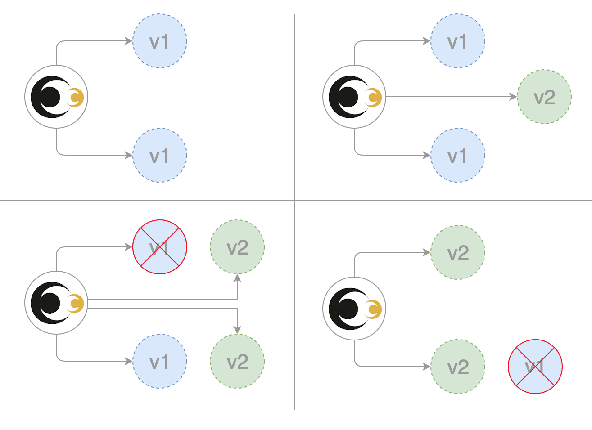

# Panoramica su Kubernetes e OpenShift

## Quali sono le problematiche della gestione manuale dei container?

Le problematiche chiave di una gestione manuale dei container riguardano:

1. il dispendio di tempo per la gestione manuale del ciclo di vita;
1. l'interconnessione tra i servizi containerizzati;
1. setup dinamico della configurazione di ambiente all'interno del container.

## Perché necessitiamo di un orchestratore?

Un orchestratore affronta le problematiche appena descritte nei seguenti modi:

1. scaling orizzontale trasparente e rolling update;
1. esistono *Operators* che agevolano operazioni complesse sulle risorse dell'infrastruttura;
1. key-value store distribuiti.

Quindi, un orchestratore ci da la possibilità di scalare la nostra applicazione orizzontalmente in base alle esigenze in maniera automatizzata, secondo policy ben definite che permettono di integrare il *load balancing* nella nostra applicazione; in più ci vengono incontro i *rolling update*, i quali consentono l'aggiornamento delle applicazioni senza tempi di inattività, sostituendo in modo incrementale le instanze dei *Pod*.

Kubernetes in particolare usa `etcd` per archiviare la sua configurazione, il suo stato e i suoi metadati: infatti, trattandosi di 
un sistema distribuito, ha bisogno di un archivio dati distribuito (come `etcd`), che consente a qualsiasi nodo del 
*cluster* di accedere ai dati condivisi dagli altri container; è possibile gestire gli accessi e il livello di condivisione di tali dati per garantire che siano utilizzabili dalle applicazioni che ne hanno bisogn anche durante lo scaling.

#### *Processo di Rolling update*

## Limiti delle risorse, autoscaling in base al traffico

Un orchestratore permette di impostare limiti alle risorse di un singolo container, oppure di condividere risorse 
all'interno di un progetto tramite quote. In questo modo è possibile ottimizzare la capacità computazionale 
dell'hardware a disposizione.

## Health check, reagire tempestivamente agli errori

Tra le funzionalità che un orchestratore implementa, c'è la possibilità di progettare dei controlli per la fase di 
avvio e per il runtime della propria applicazione. In caso di problemi, l'orchestratore può terminare e sostituire i 
container che non si comportano come stabilito.

## Blu/Green deployment

OpenShift permette di scegliere la strategia di deploy della propria applicazione; le più usate sono:

- `rolling`: prima vengono creati container contenenti la nuova versione dell'applicazione, poi i container con la 
versione vecchia saranno terminati;
- `blue/green`: ad uno ad uno i container con la nuova versione dell'applicazione vengono creati e progressivamente 
i container con la vecchia versione vengono terminati.

## Operators, di cosa parliamo?

Anche se possiamo delegare a un orchestratore il ciclo di vita dei nostri servizi containerizzati, ci sono degli 
elementi dell'infrastruttura che non è possibile concepire come auto-contenuti: per questo motivo, gli orchestratori 
come Kubernetes implementano i cosiddetti "*Operators*".

Si tratta di oggetti che permettono a un amministratore di dare all'orchestratore istruzioni più specifiche su come 
gestire e completare un task complesso, che comunque non si potrebbe risolvere modellando la soluzione con un 
container; per esempio:

- fornire una rete a cui connettere i container che insieme realizzano logicamente lo stesso servizio;
- gestire il backup dei dati associati a un container che contiene un database.

## Kubernetes e OpenShift

Abbiamo mostrato con una panoramica come sia essenziale usare un orchestratore per ottenere il meglio dalla propria 
infrastruttura basata su microservizi; l'orchestratore per eccellenza che rispecchia quanto introdotto è Kubernetes, 
lo stesso progetto su cui OpenShift si basa, e del quale estende le funzionalità e le risorse.

> Red Hat® OpenShift® è una piattaforma container per le imprese basata su Kubernetes, che offre operazioni automatizzate in tutto lo stack per gestire deployment di cloud ibridi e multi-cloud. Red Hat OpenShift è ottimizzato per incrementare la produttività degli sviluppatori e promuovere l'innovazione (dal [sito ufficiale](https://www.redhat.com/it/technologies/cloud-computing/openshift)).