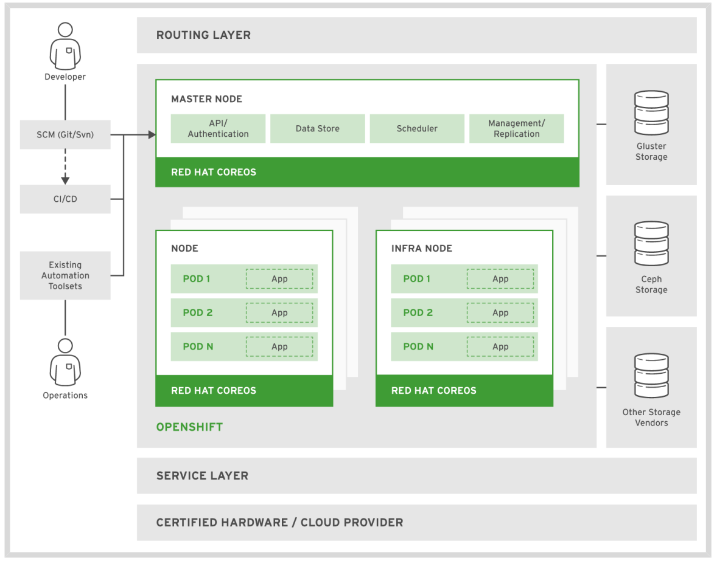

# Introduzione a Openshift

Le nozioni apprese fino ad ora permettono di creare dei container sulla nostra workstation/server: ma come possiamo garantire la funzionalità della nostra applicazione se il singolo server smettesse di funzionare? 

Ecco quindi la necessità di avere un insieme di nodi (virtuali o fisici) che garantisce l'alta affidabilità: abbiamo bisogno di un orchestratore.

Kubernetes è l'orchestratore di container (standard de-facto) creato da Google e open source.

Openshift è la distribuzione Red Hat di Kubernetes per ambiti enterprise. Openshift aggiunge molte funzionalità a Kubernetes ed è certificato dalla CNCF , ecco perchè è la distribuzione di Kubernetes più utilizzata con il [44% di market share](https://www.openshift.com/blog/enterprise-kubernetes-with-openshift-part-one)

Questa è un'overview dell'architettura di Openshift

## Pod

In Kubernetes (e quindi anche in Openshift) interagiamo con una risorsa fondamentale chiamata Pod.
I Pod consistono in uno o più container che condividono gli stessi kernel namespace (Network e UTS) con altri metadati aggiuntivi

Molto spesso la risorsa Pod contiene un solo container. Per questo corso introduttivo useremo Pod con un container.

## Nodes

In un cluster Kubernetes abbiamo nodi dedicati chiamati "master" che offrono fra l'altro queste funzionalità:

- autenticazione
- scheduling delle risorse
- controllo delle repliche

etc..

i nodi chiamati "workers" sono i nodi dove effettivamente i containers dei Pod vengono eseguiti

# Esempio di risorse fondamentali di Kubernetes

## Services

La risorsa Service fornisce un indirizzo ip persistente (visibile solo all'interno del cluster) grazie al quale possiamo comunicare con i Pod

## Replication controllers

Questa risorsa definisce come i pods della stessa applicazione sono replicati (scalati orrizontalmente) nei diversi nodi workers

## Persistent Volume

Definisce lo storage persistente utilizzabile dai Pod

## Persistent Volume Claims

Rappresenta la richiesta di storage da parte dei Pod

## ConfigMaps e Secrets

Contengono informazioni utilizzabili da altre risorse

# Esempio di risorse fondamentali di Kubernetes

Openshift aggiunge delle risorse fra le quali:

## Deployment Config

Contiene le informazioni su come effettuare il deploy della nostra applicazione. Per esempio:

- numero di repliche
- richiesta di storage
- variabili d'ambiente

## Build Config

Definisce le informazioni per creare la nostra applicazione: Per esempio:

- url del codice sorgente (es repo git)
- variabili d'ambiente da utilizzare nel solo processo di build
- strategia di build

## Routes

Permettono di esporre le applicazioni HTTP based

Ecco un esempio di architettura Openshift

## Novità in Openshift 4

- CoreOS
- Semplicità di installazione
- Operators

Per interagire con Openshift da linea di comando possiamo utilizzare l'utility 'oc'

Nella dimostrazione verrà creata un'applicazione di esempio in openshift utilizzando anche le variabili di ambiente

- oc new-app
- oc get
- oc describe
- oc export
- oc create
- oc exec 

