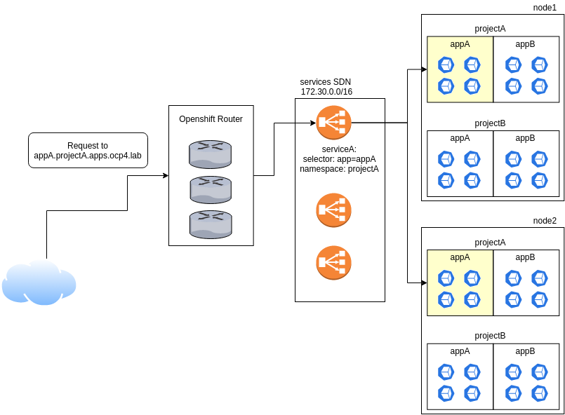

## Accedere alle applicazioni all'esterno del nostro cluster - Openshift Routes

Abbiamo la nostra applicazione, siamo riusciti ad eseguire il deploy con `oc new-app` all'interno del nostro cluster ed in fase di deploy ci è stato creato il service che andrà a fare da load-balancer per i nostri pod applicativi.  
Tuttavia, come sappiamo, l'accesso al service è consentito solamente all'interno del nostro cluster, in quanto possiamo andarlo a contattare esclusivamente con l'IP che gli  è stato assegnato sulla network di Openshift.  
Openshift ci mette a disposizione un potente strumento, le **routes**.  
Le routes sono una risorsa che si fa carico di assegnare un hostname, esposto sul DNS infrastrutturale, ad un particolare service per renderlo raggiungibile dall'esterno del cluster.  

Le routes possono essere utilizzate per instradare traffico Layer 7, quindi potremo configurare rotte per servire richieste di tipo:
- http
- https
- websocket

Per instradare traffico diverso, sarà necessario utilizzare un tipo di servizio particolare, il **NodePort**, che di fatto mappa una porta del service su una porta fisica dei nodi, rendendo la nostra applicazione accessibile direttamente puntando al nodo ed alla porta definiti.

## Cosa sono le routes?

Procediamo per gradi! Iniziamo col vedere come è descritta una route all'interno di Openshift:

    [student@workstation ~]$ oc get route hello-extraordy -o yaml
    apiVersion: route.openshift.io/v1
    kind: Route
    metadata:
      labels:
        app: hello-extraordy
      name: hello-extraordy
      namespace: hello-extraordy
    spec:
      host: hello-extraordy-hello-extraordy.apps.ocp4.hetzner.lab
      port:
        targetPort: 8080
      to:
        kind: Service
        name: hello-extraordy
        weight: 100

Nella sezione '`metadata`' possiamo vedere che troviamo informazioni identificative della nostra risorsa, nello specifico:
- `labels` **-->** Ci permettono di 'marcare' la risorsa per poterla selezionare ed assegnare ad altre risorse attraverso filtri (selectors, ecc.)
- `name` **-->** Il nome della risorsa, se non specificato è impostato di default al nome del service
- `namespace` **-->** Il nome del progetto/namespace a cui è assegnata la risorsa

Nella sezione '`spec`' troviamo il core della definizione della nostra risorsa:
- `host` **-->** l'hostname assegnato alla nostra risorsa, che definirà la entry DNS interna di Openshift.
- `port.targetPort` **-->** Attraverso questo marker si va a definire quale è la porta del nostro service che viene associata all'hostname indicato.
- `to.kind` **-->** La tipologia di risorsa a cui verrà bindata la nostra route
- `to.name` **-->** Il nome della risorsa a cui sarà bindata la nostra route. 
- `to.weight` **-->** Il 'peso' del servizio in ottica di bilanciamento, nel caso più comune, di un solo servizio gestito dalla route, sarà sempre 100.

A livello logico, quello che succede è molto semplice.  
A fronte di una richiesta, questa sarà indirizzata, utilizzando una wildcard definita nel DNS dell'infrastruttura che ospita il cluster, al loadbalancer che bilancia le chiamate verso il router Openshift.  
Internamente, la richiesta viene instradata verso i pod applicativi attraverso il service che fa da bilanciatore.  

In sintesi:  

I **selector** che vediamo indicati nell'immagine rappresenta il modo in cui il **service** si 'aggancia' ai pod che servono l'applicazione **appA** e conosce gli indirizzi dei pod su cui rigirare la richiesta.

## Esporre un servizio
Come abbiamo detto, ciò che andiamo ad esporre utilizzando le routes sono i servizi, per questo andiamo a vedere nel dettaglio come possiamo fare.  
Per esporre un servizio, utilizzando il nostro client Openshift, **oc**, andiamo ad identificare innanzitutto quale servizio vogliamo andare a gestire:

    [student@workstation ~]$ oc get services
    NAME              TYPE        CLUSTER-IP      EXTERNAL-IP   PORT(S)    AGE
    hello-extraordy   ClusterIP   172.30.115.58   <none>        8080/TCP   41h

Accertiamoci che non ci siano già routes definite:

    [student@workstation ~]$ oc get routes
    No resources found.

Andiamo ad esporre il nostro servizio! 

    [student@workstation ~]$ oc expose service hello-extraordy
    route.route.openshift.io/hello-extraordy exposed

Possiamo subito verificare che la nostra route sia stata eseguita!

    [student@workstation ~]$ oc get routes
    NAME              HOST/PORT                                               PATH   SERVICES          PORT   TERMINATION   WILDCARD
    hello-extraordy   hello-extraordy-hello-extraordy.apps.ocp4.hetzner.lab          hello-extraordy   8080                 None

Nel caso in oggetto, l'applicazione è un semplice webserver, che serve due endpoint (/ e /ascii) che mostrano un'immagine e la versione dell'immagine in ASCII. 
Testiamo subito il nostro risultato:

    [student@workstation ~]$ curl hello-extraordy-hello-extraordy.apps.ocp4.hetzner.lab/ascii
    MMMMMMMMMMMMMMMMMMMMMMMMMMMMMMMMMMMMMMMMMMMMMMMMMMMMMMMMMMMMMMMMMMMMMMMMMMMMMMMMMMMMMMMMMMMMMMMMMMMMMMMMMMMMMMMMMMMMMMMM
    MMMMMMMMMMMMMMMMMMMMMMMMMMMMMMMMMMMMMMMMMMMMMMMMMMMMMMMMMMMMMMMMMMMMMMMMMMMMMMMMMMMMMMMMMMMMMMMMMMMMMMMMMMMMMMMMMMMMMMMM
    MMMMMMMMMMMMMMMMMMMMMMMMMMMMMMMMMMMMMMMMMMMMMMMMMMMMMMMMMMMMMMMMMMMMMMMMMMMMMMMMMMMMMMMMMMMMMMMMMMMMMMMMMMMMMMMMMMMMMMMM
    MMMMMMMMMMMMMMMMMMMMMMMMMMMMMMMMMMMMMMMMMMMMMMMMMMMMMMMMMMMMMMMMMMMMMMMMMMMMMMMMMMMMMMMMMMMMMMMMMMMMMMMMMMMMMMMMMMMMMMMM
    MMMMMMMMMMMMMMMMMMMMMMMMMMMMMMMMMMMMMMMMMMMMMMMMMMMMMMMMMMMMMMMMMMMMMMMMMMMMMMMMMMMMMMMMMMMMMMMMMMMMMMMMMMMMMMMMMMMMMMMM
    MMMMMMMN8ZZZ8NMMMMMMMMMMMMMMMMMMMMMMMMMMMMMMMMMMMMMMMMMMMMMMMMMMMMMMMMMMMMMMMMMMMMMMMMMMMMMMMMMMMMMMMMMMMMMMMMMMMMMMMMMM
    MMMM8?:....,:~+7DMMMMMMMMMMMMMMMMMMMMMMMMMMMMMMMMMMMMMMMMMMMMMMMMMMMMMMMMMMMMMMMMMMMMMMMMMMMMMMMMMMMMMMMMMMMMMMMMMMMMMMM
    MMN?...,I8MMMMDZ7OMMMMMMMMMMMMD88888NMDDMMMMM8MD88DD88DMD888MMMMMMMMNNMMMMMMMMN8O88NMMMMMD88DMMMMND8DNMMMMMDMMMMMMMNNMMM
    MN:...?888DMMMMMMNDNNMMMMMMMMD.=++++ZMO.ZMMM~=M$++,,++7N.~+=~?NMMMMN.~MMMMMM8II$ZZ$IIDMM8~Z$$I$MM+7Z$7I7DMM$IMMMMMD=DMMM
    M=...~+,...,7MMMMD$$?=?DMMMMMD.8MMMMMMMZ.OM=:MMMMM++MMMN.8MMN~~MMMM=:.$MMMM$+8MMMMMM8+ZM8+MMMMIIM+NMMMMO=OMMIIMMMN=DMMMM
    8............?MMMNM8I+..8MMMMD.DMMMMMMMM$,=:MMMMMM==MMMN.8MMMD.DMMO.MZ.NMM8=MMMMMMMMMM~N8+MMMMM~M+DMMMMMN~NMM?7MN=8MMMMM
    $.............NMMMO.....=MMMMD.=++++ZMMMM=.8MMMMMM==MMMN.8MMN~~MMM:,$7.?MMIZMMMMMMMMMM7$D+MMMN?7M+DMMMMMMI$MMM?$+OMMMMMM
    Z............~MMMMN~,:,.?MMMMD.7OOOODMMMI,I,DMMMMM==MMMN.~+~~?NMM7.$77I.8M77MMMMMMMMMM?OD~$$IIZMM+DMMMMMM+OMMMM:$MMMMMMM
    M,...:,.....~DMMN8DD$=.+MMMMMD.DMMMMMMM7.DM?,NMMMM==MMMN.$8=,MMMN.$MMMM=~MN=8MMMMMMMMZ=M8=DD+7MMM+DMMMMM$+MMMMM?8MMMMMMM
    MO...,7ZI?IOMMMMMNZ$778MMMMMMD.$8888NM7.8MMM+,DMMM==MMMN.8MM+,8M=:MMMMMN.$MD+7DMMMM8I?NM8+MMM?IMM=8MMNOI?MMMMMM+OMMMMMMM
    MMO:...?DMMMMMMNOOMMMMMMMMMMMN======ZN=OMMMMM?IMMM77MMMN=DMMMI?D=8MMMMMM$?MMMO7777778MMMD7MMMMI8M7I777$8MMMMMMM7DMMMMMMM
    MMMN7:....~+??+?OMMMMMMMMMMMMMMMMMMMMMMMMMMMMMMMMMMMMMMMMMMMMMMMMMMMMMMMMMMMMMMMMMMMMMMMMMMMMMMMMMMMMMMMMMMMMMMMMMMMMMMM
    MMMMMM8$I+=+?$DMMMMMMMMMMMMMMMMMMMMMMMMMMMMMMMMMMMMMMMMMMMMMMMMMMMMMMMMMMMMMMMMMMMMMMMMMMMMMMMMMMMMMMMMMMMMMMMMMMMMMMMMM
    MMMMMMMMMMMMMMMMMMMMMMMMMMMMMMMMMMMMMMMMMMMMMMMMMMMMMMMMMMMMMMMMMMMMMMMMMMMMMMMMMMMMMMMMMMMMMMMMMMMMMMMMMMMMMMMMMMMMMMMM
    MMMMMMMMMMMMMMMMMMMMMMMMMMMMMMMMMMMMMMMMMMMMMMMMMMMMMMMMMMMMMMMMMMMMMMMMMMMMMMMMMMMMMMMMMMMMMMMMMMMMMMMMMMMMMMMMMMMMMMMM
    MMMMMMMMMMMMMMMMMMMMMMMMMMMMMMMMMMMMMMMMMMMMMMMMMMMMMMMMMMMMMMMMMMMMMMMMMMMMMMMMMMMMMMMMMMMMMMMMMMMMMMMMMMMMMMMMMMMMMMMM
    MMMMMMMMMMMMMMMMMMMMMMMMMMMMMMMMMMMMMMMMMMMMMMMMMMMMMMMMMMMMMMMMMMMMMMMMMMMMMMMMMMMMMMMMMMMMMMMMMMMMMMMMMMMMMMMMMMMMMMMM
    MMMMMMMMMMMMMMMMMMMMMMMMMMMMMMMMMMMMMMMMMMMMMMMMMMMMMMMMMMMMMMMMMMMMMMMMMMMMMMMMMMMMMMMMMMMMMMMMMMMMMMMMMMMMMMMMMMMMMMMM

## **Posso cambiare l'hostname?**
Come abbiamo visto, durante l'esposizione del service non abbiamo dovuto specificare nulla per quanto riguarda l'hostname, ed Openshift ha assegnato un hostname di default, composto in un modo particolare.  
Ogni hostname generato da Openshift si presenta nella forma:

    <app-name>-<proj-name>.<apps-wildcard>.<cluster-name>.<dnsdomain>

Dove `app-name` e `proj-name` si riferiscono al nome della nostra applicazione e del progetto/namespace.  
Per quanto riguarda invece `apps-wildcard` e `cluster-name`, ci stiamo riferendo a due parametri che fanno riferimento all'installazione del nostro cluster.  
Nello specifico:
- `dnsdomain` fa riferimento al dominio DNS dell'infrastruttura che ospita il cluster Openshift
- `apps-wildcard` è una wildcard DNS definita sul DNS dell'infrastruttura che ospita il cluster, di default `*.apps.<cluster-name>.<dnsdomain>`

Ma se volessimo cambiarlo? Nulla di più semplice!   
In fase di `expose` del service si può specificare con l'opzione `--hostname` un hostname diverso.  

Riprendendo il nostro esempio:

    [student@workstation ~]$ oc expose service hello-extraordy --hostname=extraordy.apps.ocp4.hetzner.lab
    route.route.openshift.io/hello-extraordy exposed

E possiamo verificare che è stata correttamente creata:

    [student@workstation ~]$ oc get routes
    NAME              HOST/PORT                         PATH   SERVICES          PORT   TERMINATION   WILDCARD
    hello-extraordy   extraordy.apps.ocp4.hetzner.lab          hello-extraordy   8080                 None

Andando a verificare la bontà della configurazione, vediamo che effettivamente il puntamento è stato modificato, ma la nostra applicazione risulta funzionante!

    [student@workstation ~]$ curl extraordy.apps.ocp4.hetzner.lab/ascii
    MMMMMMMMMMMMMMMMMMMMMMMMMMMMMMMMMMMMMMMMMMMMMMMMMMMMMMMMMMMMMMMMMMMMMMMMMMMMMMMMMMMMMMMMMMMMMMMMMMMMMMMMMMMMMMMMMMMMMMMM
    MMMMMMMMMMMMMMMMMMMMMMMMMMMMMMMMMMMMMMMMMMMMMMMMMMMMMMMMMMMMMMMMMMMMMMMMMMMMMMMMMMMMMMMMMMMMMMMMMMMMMMMMMMMMMMMMMMMMMMMM
    MMMMMMMMMMMMMMMMMMMMMMMMMMMMMMMMMMMMMMMMMMMMMMMMMMMMMMMMMMMMMMMMMMMMMMMMMMMMMMMMMMMMMMMMMMMMMMMMMMMMMMMMMMMMMMMMMMMMMMMM
    MMMMMMMMMMMMMMMMMMMMMMMMMMMMMMMMMMMMMMMMMMMMMMMMMMMMMMMMMMMMMMMMMMMMMMMMMMMMMMMMMMMMMMMMMMMMMMMMMMMMMMMMMMMMMMMMMMMMMMMM
    MMMMMMMMMMMMMMMMMMMMMMMMMMMMMMMMMMMMMMMMMMMMMMMMMMMMMMMMMMMMMMMMMMMMMMMMMMMMMMMMMMMMMMMMMMMMMMMMMMMMMMMMMMMMMMMMMMMMMMMM
    MMMMMMMN8ZZZ8NMMMMMMMMMMMMMMMMMMMMMMMMMMMMMMMMMMMMMMMMMMMMMMMMMMMMMMMMMMMMMMMMMMMMMMMMMMMMMMMMMMMMMMMMMMMMMMMMMMMMMMMMMM
    MMMM8?:....,:~+7DMMMMMMMMMMMMMMMMMMMMMMMMMMMMMMMMMMMMMMMMMMMMMMMMMMMMMMMMMMMMMMMMMMMMMMMMMMMMMMMMMMMMMMMMMMMMMMMMMMMMMMM
    MMN?...,I8MMMMDZ7OMMMMMMMMMMMMD88888NMDDMMMMM8MD88DD88DMD888MMMMMMMMNNMMMMMMMMN8O88NMMMMMD88DMMMMND8DNMMMMMDMMMMMMMNNMMM
    MN:...?888DMMMMMMNDNNMMMMMMMMD.=++++ZMO.ZMMM~=M$++,,++7N.~+=~?NMMMMN.~MMMMMM8II$ZZ$IIDMM8~Z$$I$MM+7Z$7I7DMM$IMMMMMD=DMMM
    M=...~+,...,7MMMMD$$?=?DMMMMMD.8MMMMMMMZ.OM=:MMMMM++MMMN.8MMN~~MMMM=:.$MMMM$+8MMMMMM8+ZM8+MMMMIIM+NMMMMO=OMMIIMMMN=DMMMM
    8............?MMMNM8I+..8MMMMD.DMMMMMMMM$,=:MMMMMM==MMMN.8MMMD.DMMO.MZ.NMM8=MMMMMMMMMM~N8+MMMMM~M+DMMMMMN~NMM?7MN=8MMMMM
    $.............NMMMO.....=MMMMD.=++++ZMMMM=.8MMMMMM==MMMN.8MMN~~MMM:,$7.?MMIZMMMMMMMMMM7$D+MMMN?7M+DMMMMMMI$MMM?$+OMMMMMM
    Z............~MMMMN~,:,.?MMMMD.7OOOODMMMI,I,DMMMMM==MMMN.~+~~?NMM7.$77I.8M77MMMMMMMMMM?OD~$$IIZMM+DMMMMMM+OMMMM:$MMMMMMM
    M,...:,.....~DMMN8DD$=.+MMMMMD.DMMMMMMM7.DM?,NMMMM==MMMN.$8=,MMMN.$MMMM=~MN=8MMMMMMMMZ=M8=DD+7MMM+DMMMMM$+MMMMM?8MMMMMMM
    MO...,7ZI?IOMMMMMNZ$778MMMMMMD.$8888NM7.8MMM+,DMMM==MMMN.8MM+,8M=:MMMMMN.$MD+7DMMMM8I?NM8+MMM?IMM=8MMNOI?MMMMMM+OMMMMMMM
    MMO:...?DMMMMMMNOOMMMMMMMMMMMN======ZN=OMMMMM?IMMM77MMMN=DMMMI?D=8MMMMMM$?MMMO7777778MMMD7MMMMI8M7I777$8MMMMMMM7DMMMMMMM
    MMMN7:....~+??+?OMMMMMMMMMMMMMMMMMMMMMMMMMMMMMMMMMMMMMMMMMMMMMMMMMMMMMMMMMMMMMMMMMMMMMMMMMMMMMMMMMMMMMMMMMMMMMMMMMMMMMMM
    MMMMMM8$I+=+?$DMMMMMMMMMMMMMMMMMMMMMMMMMMMMMMMMMMMMMMMMMMMMMMMMMMMMMMMMMMMMMMMMMMMMMMMMMMMMMMMMMMMMMMMMMMMMMMMMMMMMMMMMM
    MMMMMMMMMMMMMMMMMMMMMMMMMMMMMMMMMMMMMMMMMMMMMMMMMMMMMMMMMMMMMMMMMMMMMMMMMMMMMMMMMMMMMMMMMMMMMMMMMMMMMMMMMMMMMMMMMMMMMMMM
    MMMMMMMMMMMMMMMMMMMMMMMMMMMMMMMMMMMMMMMMMMMMMMMMMMMMMMMMMMMMMMMMMMMMMMMMMMMMMMMMMMMMMMMMMMMMMMMMMMMMMMMMMMMMMMMMMMMMMMMM
    MMMMMMMMMMMMMMMMMMMMMMMMMMMMMMMMMMMMMMMMMMMMMMMMMMMMMMMMMMMMMMMMMMMMMMMMMMMMMMMMMMMMMMMMMMMMMMMMMMMMMMMMMMMMMMMMMMMMMMMM
    MMMMMMMMMMMMMMMMMMMMMMMMMMMMMMMMMMMMMMMMMMMMMMMMMMMMMMMMMMMMMMMMMMMMMMMMMMMMMMMMMMMMMMMMMMMMMMMMMMMMMMMMMMMMMMMMMMMMMMMM
    MMMMMMMMMMMMMMMMMMMMMMMMMMMMMMMMMMMMMMMMMMMMMMMMMMMMMMMMMMMMMMMMMMMMMMMMMMMMMMMMMMMMMMMMMMMMMMMMMMMMMMMMMMMMMMMMMMMMMMMM

