## Utilizzare la Web Console di Openshift

Tutto quello che abbiamo visto finora può essere compiuto tramite un'interfaccia grafica.

La web console è raggiungibile all'indirizzo `https://console-openshift-console.<wildcard DNS>/`

### Funzionalità della web console

La web console ci permette di eseguire tutte le operazioni quotidiane per l'amministrazione di Openshift, per esempio:

* Creazione di applicazioni da Git, S2I e Dockerfile
* Iniziare una build a partire da un BuildConfig
* Creazione di un deploy a partire da un'immagine
* Scaling di un'applicazione
* Creazione di PVC, Config Maps, Secrets, Routes

### Creazione di un'applicazione da web console

In un modo analogo alla cli possiamo compilare e deployare la nostra applicazione.  
Per iniziare andiamo a creare un nuovo progetto

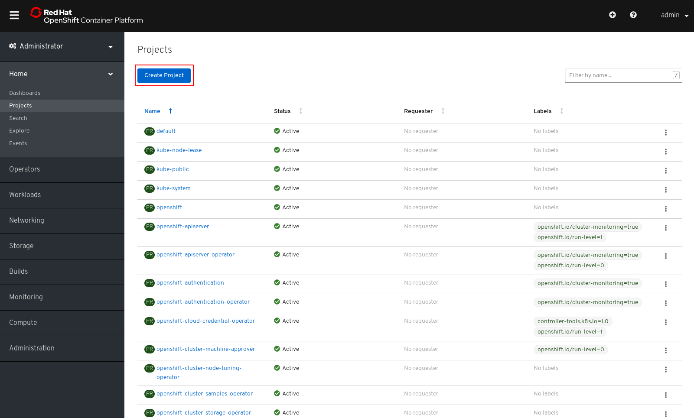

A questo punto definiamo il nome del nostro progetto, "Display Name" e "Description" sono opzionali ma possono aiutare, attenzione non mettere un "Display Name" che crei confusione

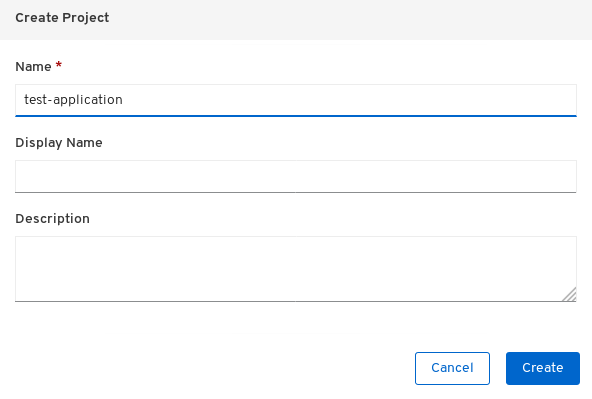

Appena creato il progetto ci viene proposta questa schermata, confermandoci che il progetto è stato creato con successo e mostrando l'attuale uso delle risorse, che sarà a zero dato che non ci sono ancora dei workloads

< Da rifare con crc/grafici funzionanti >

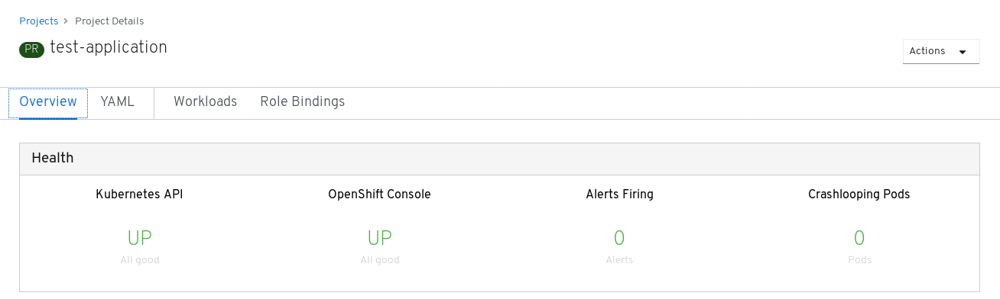

Clicchiamo su "Workloads" ci viene proposta questa schermata, la quale lista i `Deployment` ed i `DeplymentConfig`

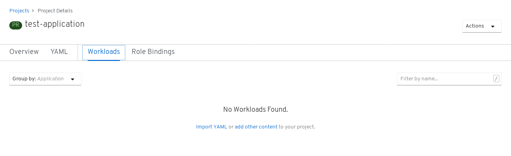

Dalla schermata dei Workloads selezioniamo "Add other content" che ci porta ad una selezione di vari metodi per creare il nostro deployment

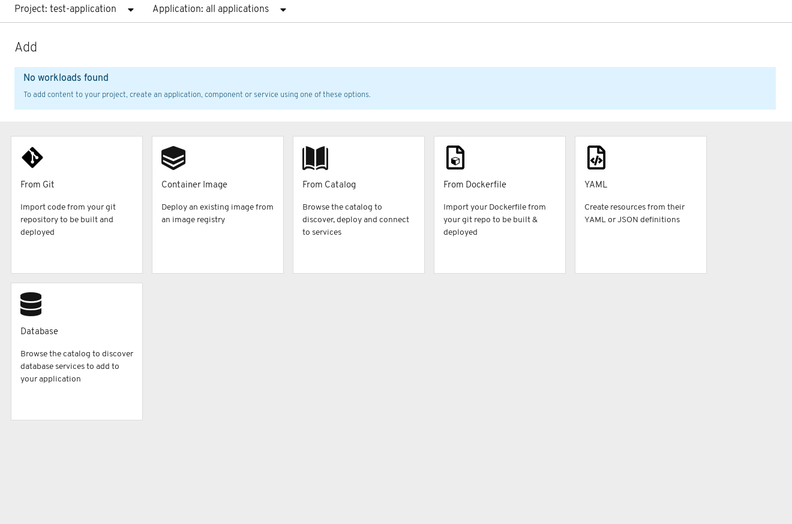

Da qui andiamo su "From Catalog", ci verrà mostrata una list di template

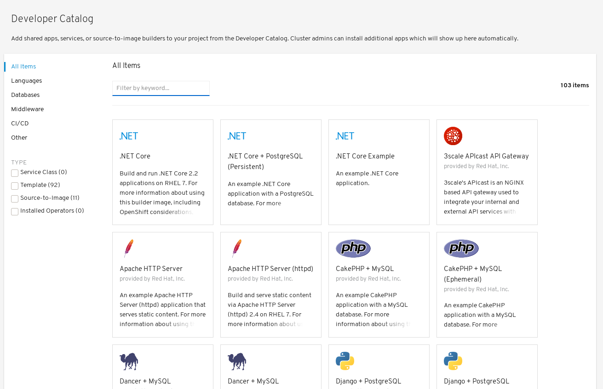

selezionamo "Go"

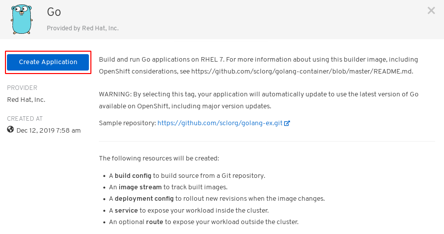

Procediamo ad indicare il repo git da utilizzare. Per questo esempio useremo il repo `https://github.com/sclorg/golang-ex`

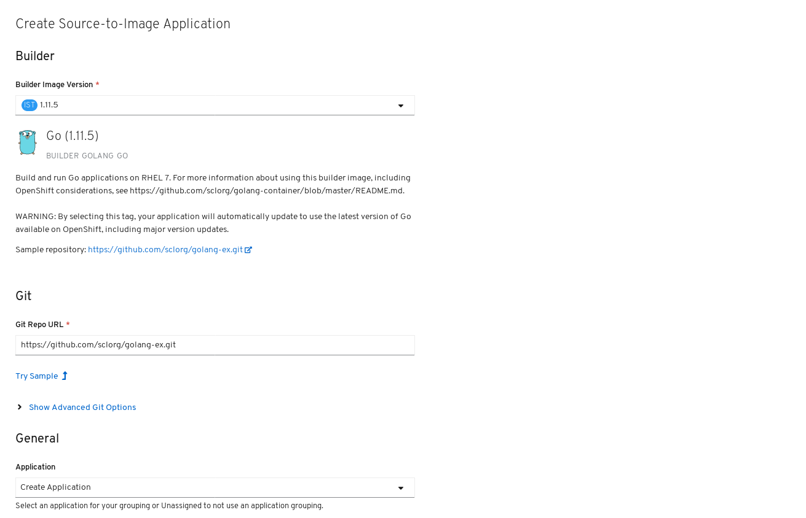

Clicchiamo su "Create" e notiamo che ci sono state create
* Una `BuildConfig` già partita che sta compilando la nostra applicazione
* Il `DeploymentConfig`, `Service` e `Route` relativi

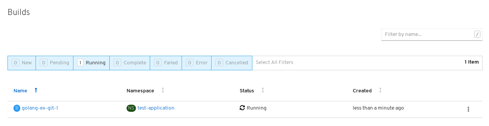

Cliccando sul nome possiamo vedere lo stato della build

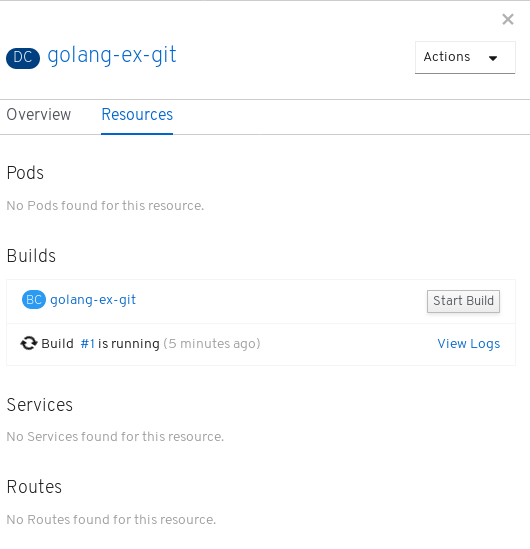

Appena la build è conclusa la nosta applicazione sarà deployata

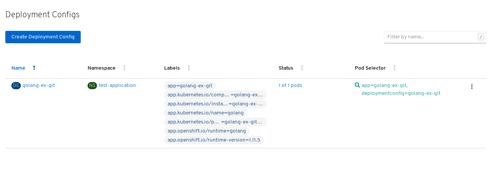

Come si può osservare la Web Console permette l'utilizzo di tutte le operazioni amministrative tramite una GUI, quindi senza la necessità di dover conoscere i relativi comandi da shell per poter eseguire gli specifici task, fornendo inoltre un modo semplice e intuitivo di analizzare stato e consumi di risorse nel cluster.