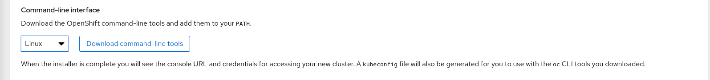
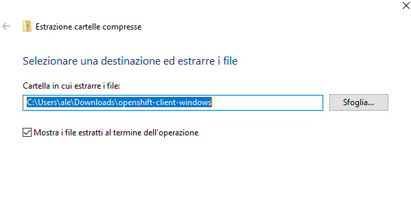
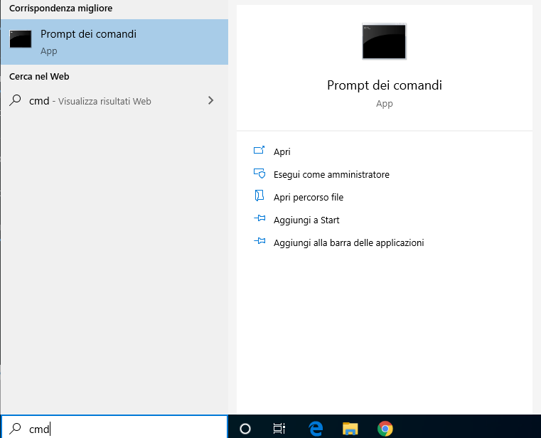

# Come installare il la CLI per Openshift (oc)

Per interagire con il nostro cluster, ci viene fornito un tool, oc, che ci permette di eseguire comandi, attraverso chiamate REST, all'API server di Openshift.
Il procedimento per installarlo è molto semplice, ed il tool è presente e supportato per tutte le piattaforme, Windows, Linux e MacOS.

## Eseguire il download
Il tool è disponibile per il download alla pagina [https://cloud.redhat.com/openshift/install/metal/user-provisioned](https://cloud.redhat.com/openshift/install/metal/user-provisioned)

Una volta eseguito il login, in fondo troveremo la parte che ci interessa:

Azionando il menù a tendina, potremo scegliere la versione che ci occorre tra quelle disponibili (Windows, Linux, MacOS) e cliccare su "Download command-line tools".

## Installazione su Linux
Una volta eseguito il download, sarà sufficiente estrarre il file scaricato, **openshift-client-linux.tar.gz**:

    [student@workstation do080]$ tar -xvf openshift-client-linux.tar.gz 
    README.md
    oc
    kubectl

Potremo poi installare il nostro eseguibile all'interno della directory **/usr/bin**:

    [student@workstation do080]$ sudo install oc /usr/bin/ -v
    'oc' -> '/usr/bin/oc'

Oppure creare una nuova directory in cui posizionare il nostro client ed aggiungerla al nostro PATH:

    [student@workstation do080]$ mkdir openshift-cli
    [student@workstation do080]$ cd openshift-cli/ && cp ../oc .
    [student@workstation do080]$ export PATH=$PATH:$(pwd)
    [student@workstation do080]$ echo $PATH
    /usr/local/bin:/usr/local/sbin:/usr/bin:/usr/sbin:/home/student/do080/openshift-cli

Possiamo infine verificare la nostra installazione:

    [student@workstation do080]$ oc version
    Client Version: openshift-clients-4.2.2-201910250432-12-g72076900

## Installazione su Windows
Una volta scaricato il file, è sufficiente estrarre l'archivio, cliccando con il tasto destro e selezionando la voce **"Estrai tutto"**. Dovremo scegliere una directory di destinazione dove inserire il nostro file:

Una volta estratto, è possibile aprire un Prompt dei comandi:

Spostarsi nella directory dove abbiamo estratto il client:

    cd C:\Users\ale\Downloads\openshift-client-windows

E verificare che il client venga eseguito correttamente:

    C:\Users\ale\Downloads\openshift-client-windows>oc version
    Client Version: 4.3.13

## Installazione su MacOS
Una volta scaricato l'archivio, dovremo estrarre il file **openshift-client-mac.tar.gz**:

    alessandro@MBPdiAlessandro Downloads % tar -xvf openshift-client-mac.tar.gz 
    x README.md
    x oc
    x kubectl

Ad estrazione completata, sarà sufficiente installare il nostro eseguibile all'interno della directory **/usr/local/bin** o qualsiasi altra directory presente nel nostro $PATH:

    alessandro@MBPdiAlessandro do080 % sudo install -v oc /usr/local/bin 
    install: oc -> /usr/local/bin/oc
Oppure creare una nuova directory in cui posizionare il nostro client ed aggiungerla al nostro PATH:

    alessandro@MBPdiAlessandro do080 % mkdir openshift-cli
    alessandro@MBPdiAlessandro do080 % cd openshift-cli/ && cp ../oc .
    alessandro@MBPdiAlessandro do080 % export PATH=$PATH:$(pwd)
    alessandro@MBPdiAlessandro do080 % echo $PATH
    /usr/local/bin:/usr/local/sbin:/usr/bin:/usr/sbin:/home/alessandro/do080/openshift-cli

E' possibile infine verificare che l'installazione sia andata a buon fine:

    alessandro@MBPdiAlessandro do080 % oc version
    Client Version: 4.3.13

**ATTENZIONE!** Potrebbe essere necessario autorizzare l'secuzione del programma **crc**, che sebbene sia affidabile, potrebbe essere bloccato.

Per fare ciò, è sufficiente andare nelle impostazioni, nella sezione Sicurezza e Privacy, e cliccare su "Consenti" nel prompt che viene proposto in basso a destra.

[https://support.apple.com/it-ch/guide/mac-help/mh43185/mac](https://support.apple.com/it-ch/guide/mac-help/mh43185/mac)
