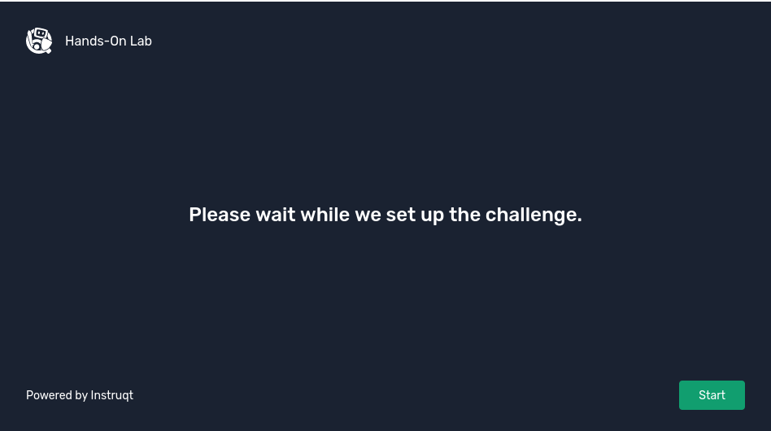
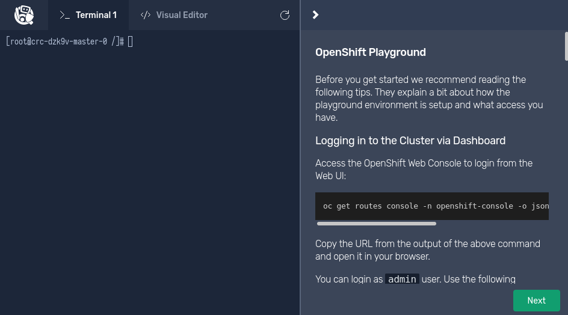
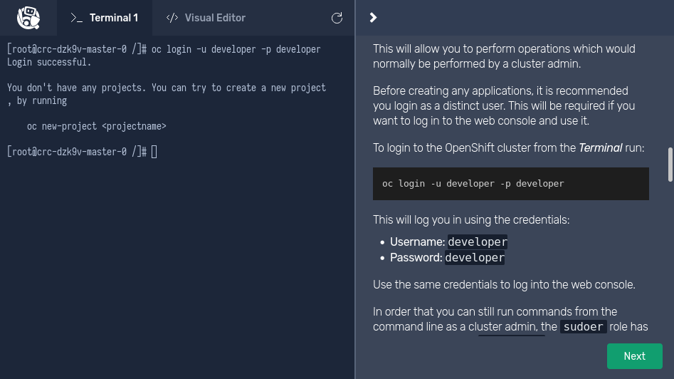
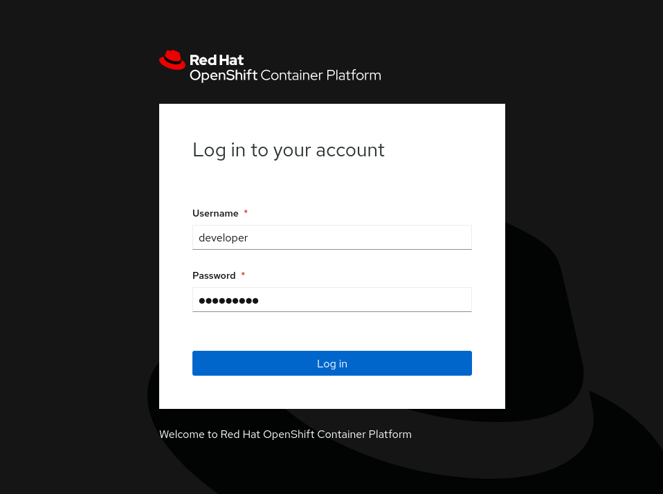
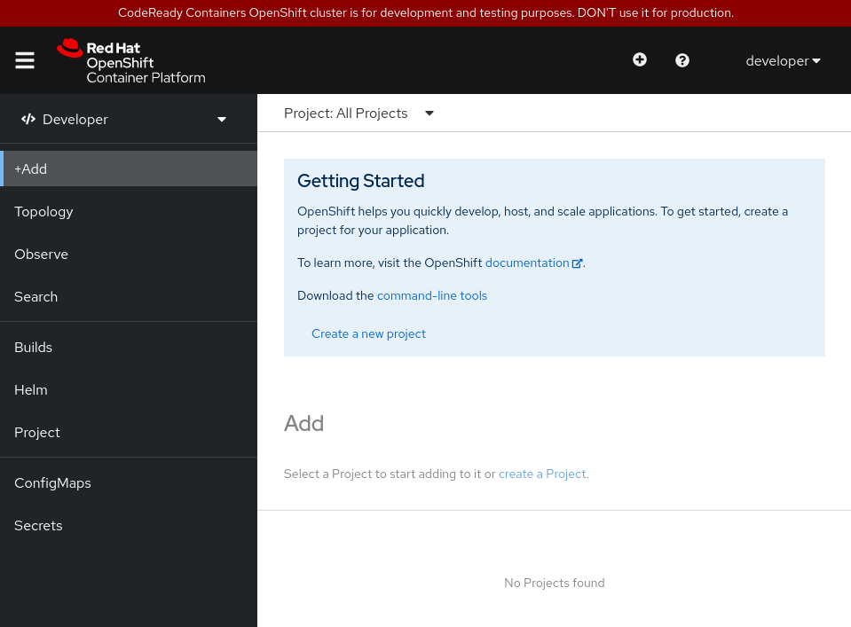

# Openshift Playground - Instruqt

Un ottimo modo per iniziare, senza necessità di registrarsi, si va a sfruttare un ambiente sandbox con un mini-cluster OpenShift configurato automaticamente, dove sarà possibile da subito eseguire i primi comandi e muovere i primi passi sulla **command line di Openshift**.

Il playground è basato su Instruqt, e permette di utilizzare ambienti di diverso tipo direttamente all'interno del nostro browser.

Per accedervi, è sufficiente collegarsi al link https://developers.redhat.com/courses/explore-openshift/openshift-playground per utilizzare una demo basata sulla più recente versione di OpenShift.

Una volta aperto il link, clicchiamo sul bottone verde "Launch" in basso a destra e dopo alcuni minuti vedremo comparire in basso a destra il bottone verde "Start":


Atterreremo sulla pagina iniziale: su di essa troviamo a destra una serie di consigli sull'uso del "**Playground**"; cliccando il bottone verde "Next" in basso a destra, l'ambiente verrà distrutto e sarà possibile inoltrare feedback sull'esperienza di utilizzo e avviare nuovamente la creazione dell'ambiente.

**NOTA**: Chiudendo la scheda del browser il playground andrà perso



Finalmente saremo pronti ad utilizzare i comandi che vedremo insieme!

Vengono messe a disposizione due utenze (nome/password):
- **developer/developer** - con accesso ridotto
- **admin/admin** - con privilegi di amministratore

Inoltre, potremo utilizzare i tab presenti nella sezione destra per muoverci tra il terminale:


E un gestore file grafico:


Per accedere alla console web, sarà necessario digitare nel terminale il seguente comando:
```bash
oc get routes console -n openshift-console -o jsonpath='{"https://"}{.spec.host}{"\n"}'
```

Copiare nel browser l'URL che verrà scritta in ritorno al comando, accettare i certificati non verificati (il dialogo cambia tra i vari browser, cliccare il bottone per "proseguire comunque"), e nella schermata di login inserire le credenziali riportate sopra:



