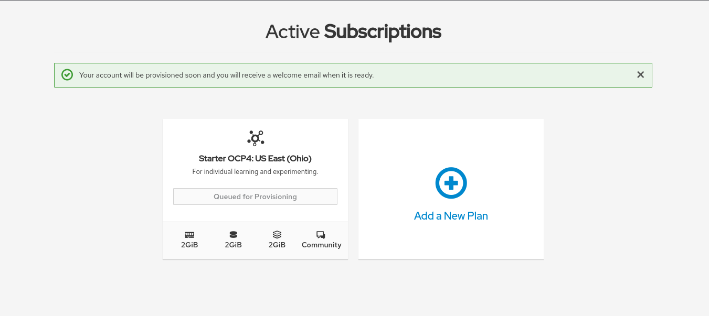

# Creazione di un cluster temporaneo - 60 giorni di prova
Tra le diverse opzioni per iniziare a mettere le nostre mani sulla tecnologia Openshift, c'è anche la possibilità di creare un cluster temporaneo minimale direttamente sulla piattaforma Red Hat.  
Per fare questo è semplicissimo, sarà sufficiente avere un account Red Hat (scopri come crearlo seguendo [questa guida](../../../guides/rhdev-subscribe/README.md)).  

Innanzitutto, collegatevi all'indirizzo [https://manage.openshift.com/register/plan](https://manage.openshift.com/register/plan)

Una volta eseguito il login, vi verrà richiesto di scegliere una tipologia di subscription, potete scegliere la prima:

Nella schermata successiva, verrà richiesto di inserire il vostro numero di telefono per una verifica dell'identità:

Ad inserimento avvenuto riceverete un PIN da inserire per la verifica:

A questo punto, il vostro cluster verrà provisionato, e lo troverete in coda:

Terminato il provisioning, si attiverà il pulsante che vi permetterà di loggarvi all'interno della web-console di Openshift:

E siete pronti ad utilizzare la vostra console web, verrà eseguito automaticamente il login all'interno della vostra instanza utilizzando il Single Sign On sulla vostra utenza Red Hat! Siete pronti per iniziare ad utilizzare il vostro cluster!

