# Installazione di podman

- [Installazione su Linux](##Linux)
- [Installazione su Windows 10](##Windows)
- [Installazione su Mac OS](##Mac%20OS)

## Linux

### Fedora, CentOS 8, RHEL 8

Sulle distribuzioni Fedora, CentOS 8 e Red Hat Enterprise Linux 8, Podman è già preinstallato nella maggior parte dei casi, ma si può verificarne la presenza con il comando `podman version`

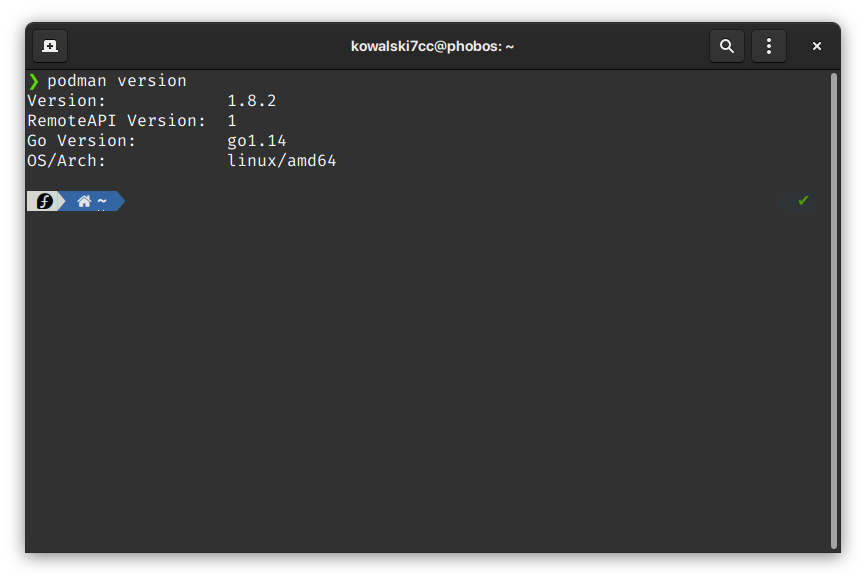

in caso di errore, sarà sufficiente installare il pacchetto mediante il comando:

```shell
yum -y install podman
```

### Ubuntu 18.04, 19.04, 19.10

Puoi installare facilmente podman su Ubuntu con i seguenti comandi:

```shell
sudo sh -c "echo 'deb https://download.opensuse.org/repositories/devel:/kubic:/libcontainers:/stable/xUbuntu_${VERSION_ID}/ /' > /etc/apt/sources.list.d/devel:kubic:libcontainers:stable.list"
curl -L https://download.opensuse.org/repositories/devel:/kubic:/libcontainers:/stable/xUbuntu_${VERSION_ID}/Release.key | sudo apt-key add -
sudo apt-get update -qq
sudo apt-get -qq -y install podman
```

### Altre distribuzioni linux

Per installare Podman su altre distribuzioni linux puoi visitare la pagina:

https://podman.io/getting-started/installation.html

## Windows

### 1) Download e installazione dei prerequisiti

Per Windows viene richiesta come versione 1909 e il download dell'ultima versione di VirtualBox [Scaricabile gratuitamente dal sito virtualbox.org](https://www.virtualbox.org/wiki/Downloads).

Una volta installato è possibile procedere con il download di

[Download di Podman-Machine](https://github.com/boot2podman/machine/releases/download/v0.17/podman-machine.windows-amd64.exe)

### 2) Installazione dell'ambiente

Rinomina `podman-machine.windows-amd64.exe` in `podman-machine.exe`, puoi usarlo con il comando da powershell `mv podman-machine.windows-amd64.exe podman-machine.exe`

```pwsh
.\podman-machine.exe create box
```


Nel caso ti venisse mostrato l'errore `VT-X non disponibile`, dovrai procedere ad abilitare la funzionalità **Piattaforma Windows Hypervisor** con la guida del punto 3, altrimenti puoi passare direttamente alla fase 4.

In base alla velocita del tuo computer, potra essere necessaario attendere più o meno tempo

### 3) Attivare "Piattaforma Windows Hypervisor"

Dal menu di ricerca digita `optionalfeatures` e apri il primo elemento come nell'immagine

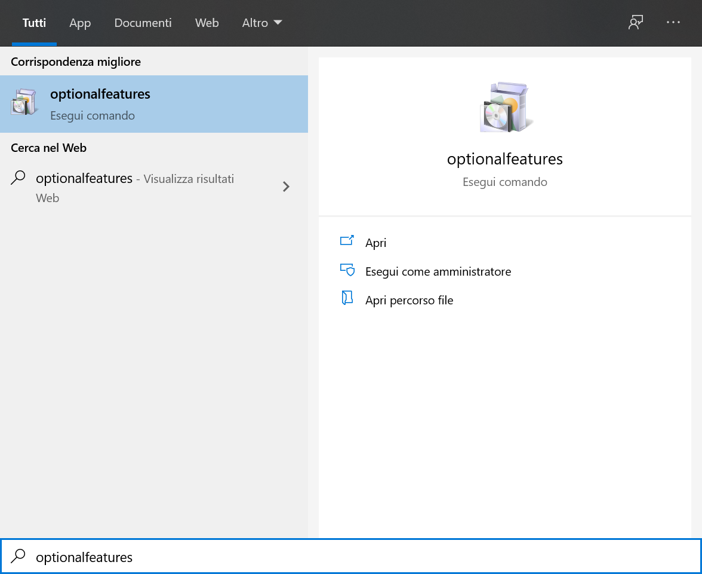

Dalla finestra che si apre, verifica di selezionare le caselle corrispondenti alle voci `Hyper-V` e `Piattaforma Windows Hypervisor`

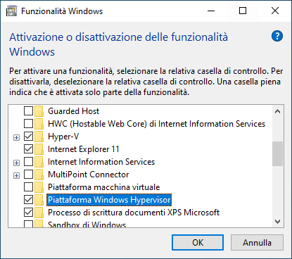

A questo punto sarà necessario riavviare il computer per rendere effettive le modifiche.

Dopo il riavvio portete usare il seguente comando per avviare podman-machine:

```pwsh
.\podman-machine.exe create box --virtualbox-no-vtx-check
```

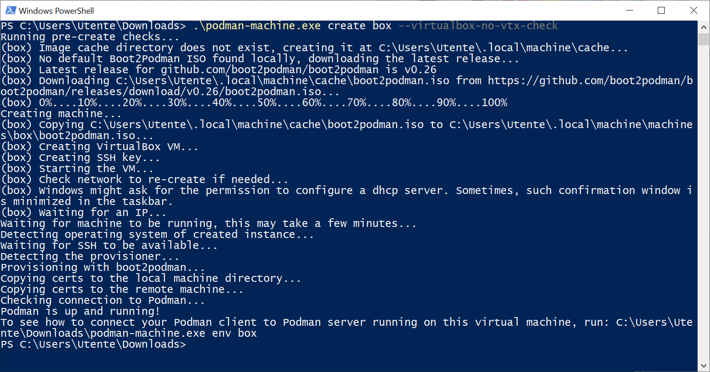

In base alla velocita del tuo computer, potra essere necessaario attendere più o meno tempo

### 4) Utilizzo dell'ambiente

Ora che podman-machine è avviato, puoi ottenere l'IP della macchina virtuale con il comando

```pwsh
.\podman-machine.exe ip
```

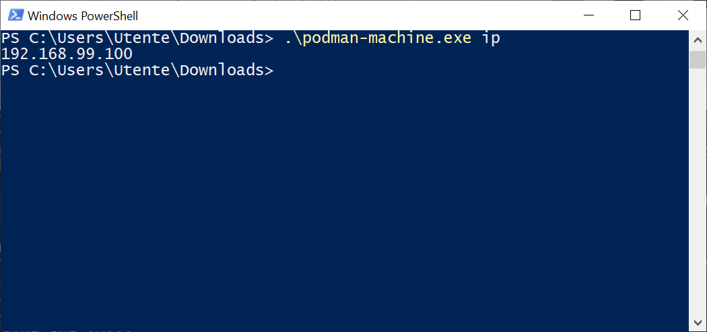

Ti verrà restituito un indirizzo simile a `192.168.99.100` (sul tuo computer potrebbe essere diverso)

Potrai inoltre collegarti alla macchina virtuale con il comando

```pwsh
.\podman-machine.exe ssh
```

Il "prompt" cambierà in `tc@box:~$`

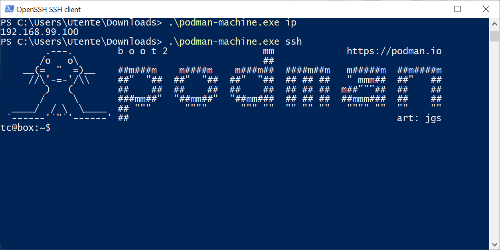

Puoi procare a eseguire un primo container con il comando:

```bash
sudo podman run --rm -itp 8080:80 nginx:alpine
```

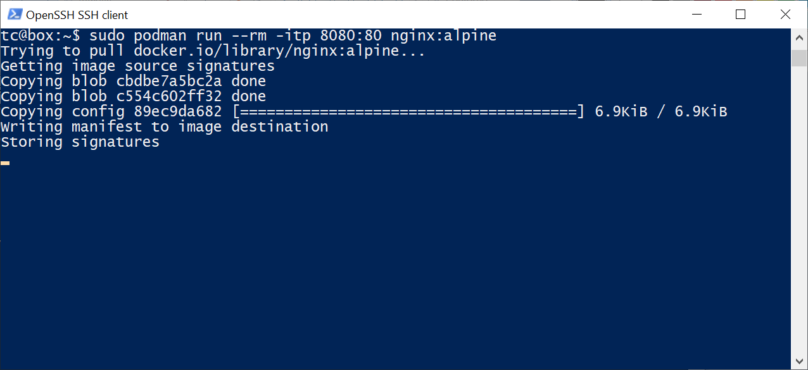

Una volta appasca la scritto `Storing signatures` puoi aprire un browser alla pagina `192.168.99.100:8080`, sostituendo l'indirizzo nel caso fosse diverso.

Se hai seguito correttamente la procedura, dovresti ruscire a vedere il messaggio di benvenuto alla pagina `192.168.99.100:8080` come nella seguente figura

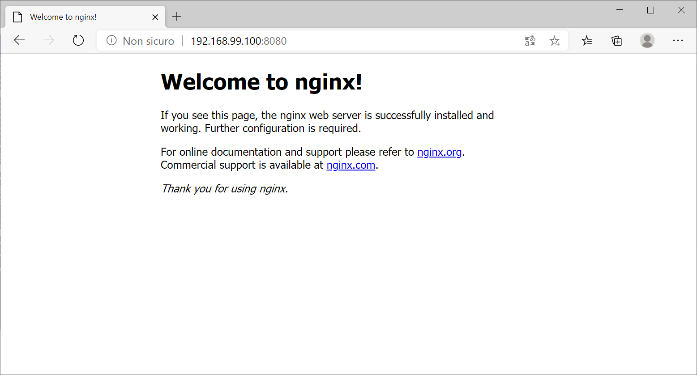

Per uscire, puoi premere la combinazione di tasti `CTRL + C` e scrivere poi `exit`

Infine per fermare podman-machine puoi usare il comando

```pwsh
.\podman-machine.exe rm box
```

## Mac OS

### 1) Installazione di VirtualBox

Vai sulla [Pagina dei download di VirtualBox](https://www.virtualbox.org/wiki/Downloads) e scarica la versione di VirtualBox per Mac OS.

Ricordati di permettere i download dal sito se usi Safari.

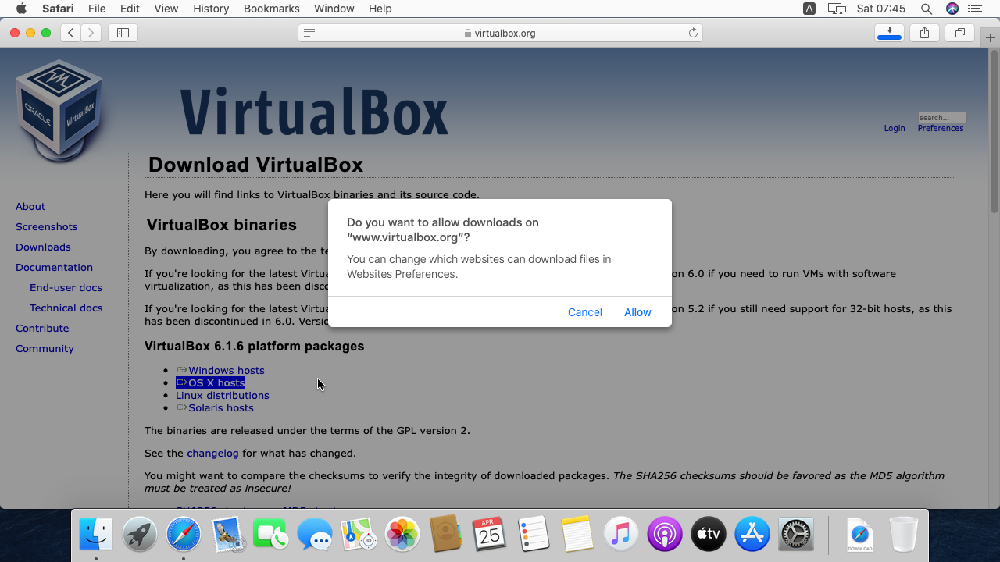

Una volta scaricato, apri `.dmg`

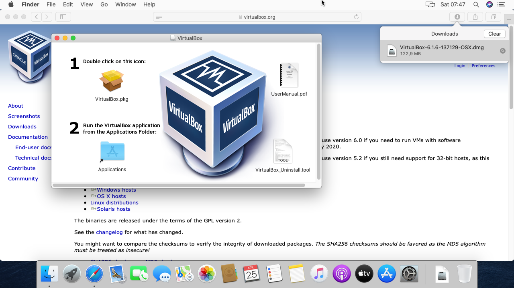

Ora seleziona `VirtualBox.pkg`

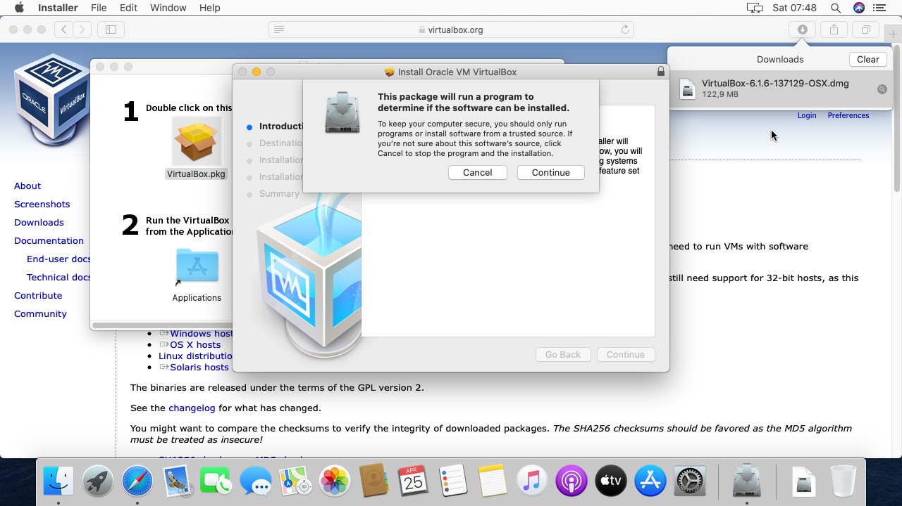

Premi continua, e successivamente installa

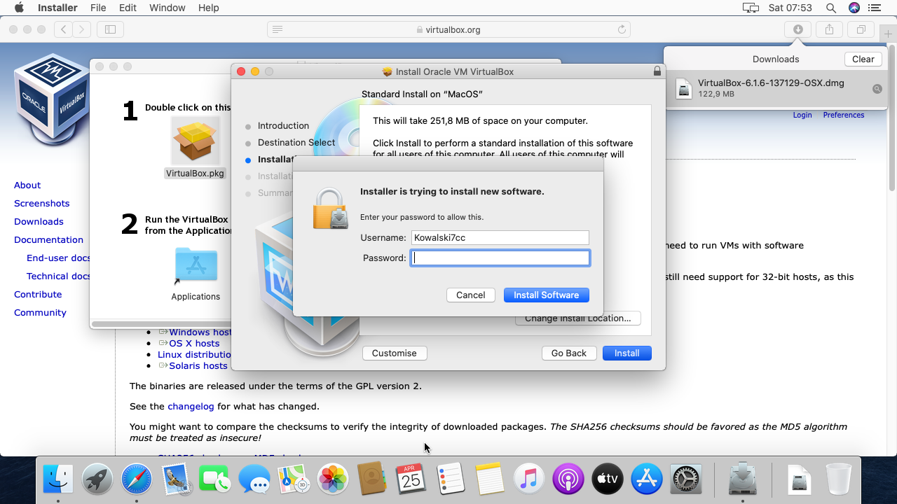

Nel caso di errore, segui la guida al passo successivo per lo sblocco di GateKeeper, altrimenti procedi pure al passo 3

### 2) Sblocco di GateKeeper

Apri le impostazioni e seleziona la voce `Sicurezza e Privacy`

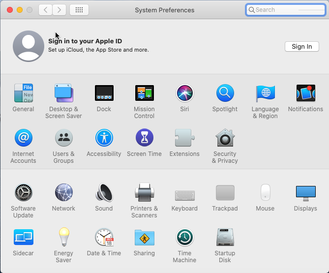

Clicca sul lucchetto in basso a sinistra, inserisci la password e premi sul pulsante di sblocco che apparirà in basso a destra con la scritta `Permetti esecuzione`

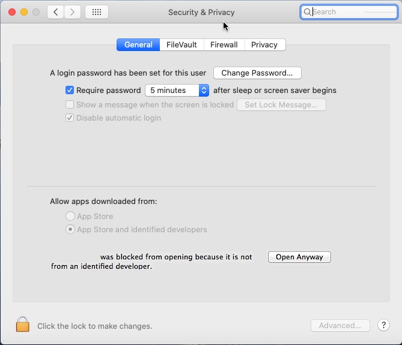

Puoi ora ripetere l'installazione del passo 1

### 3) Installazione podman-machine

Vai alla pagina di [download di podman-machine](https://github.com/boot2podman/machine/releases) e scarica `podman-machine.darwin-amd64`

Apri successivamente il terminale (Lo trovi nella cartella utilità nel launchpad o nelle applicazioni) e digita i seguenti comandi:

```zsh
cd Downloads
mv podman-machine.darwin-amd64 podman-machine
chmod +x podman-machine
./podman-machine version
```

A questo punto, se hai seguito correttamente la procedura, ti verrà mostrato un output simile a quallo nella schermata successiva:

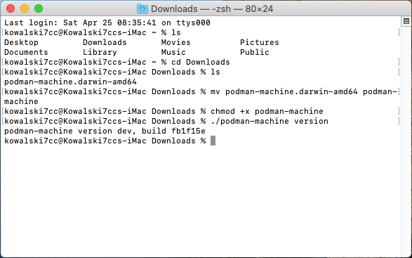

Puoi finalmente avviare l'ambiente con il comando

```zsh
./podman-machine create box
```

In base alla velocita del tuo computer, potra essere necessaario attendere più o meno tempo

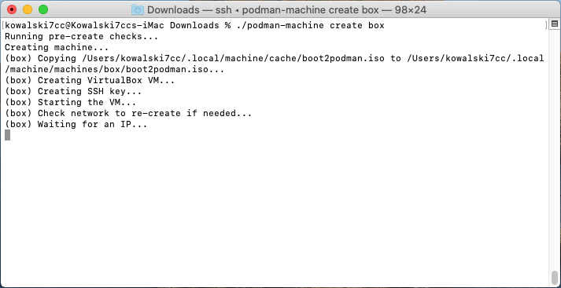

Al termine, puoi visualizzare l'IP della macchina con il comando

```zsh
./podman-machine ip
```

Ti verrà mostrato un indirizzo IP del tipo `192.168.99.100` (Ma il tuo potrebbe essere diverso)

Potrai collegarti alla console usando il comando

```zsh
./podman-machine ssh
```

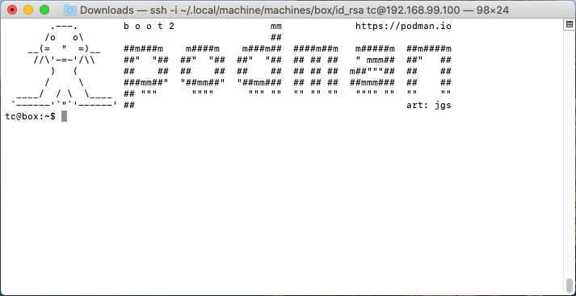

Puoi avviare un container di esempio con il comando

```bash
sudo podman run --rm -itp 8080:80 nginx:alpine
```

Una volta appasca la scritto `Storing signatures` puoi aprire Safari o un altro browser alla pagina `192.168.99.100:8080`, sostituendo l'indirizzo nel caso fosse diverso.

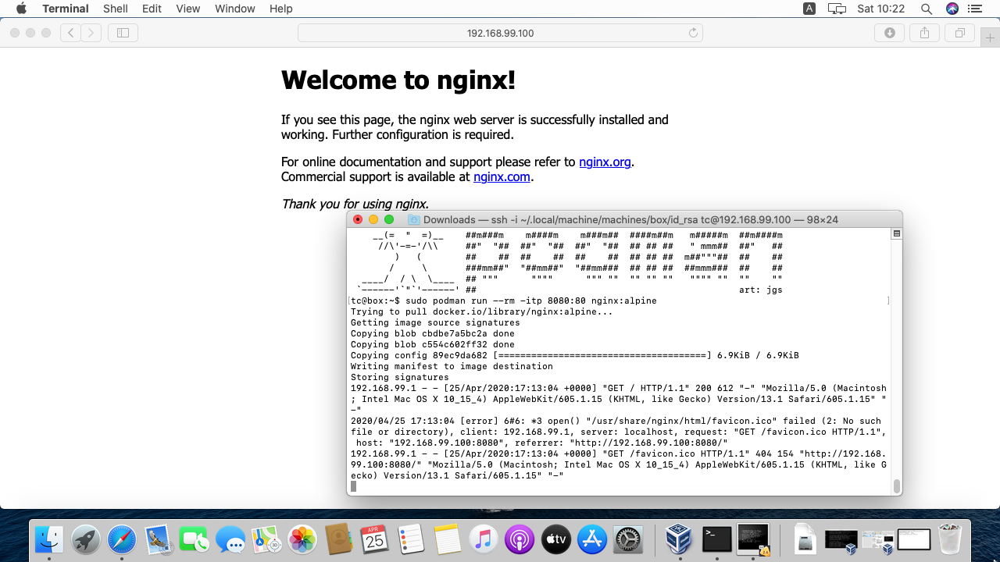

Per uscire, puoi premere la combinazione di tasti `CTRL + C` e scrivere poi `exit`

Infine per fermare podman-machine puoi usare il comando

```pwsh
.\podman-machine.exe rm box
```
